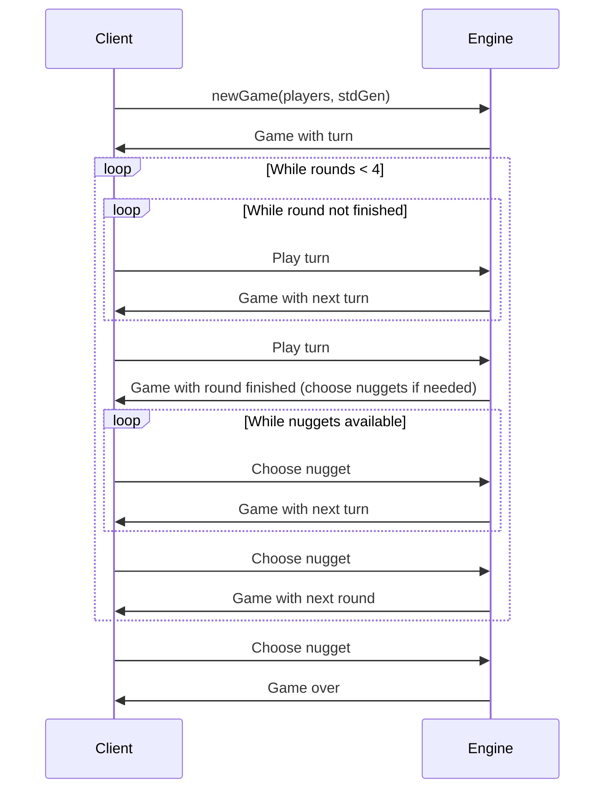

```mermaid
sequenceDiagram

Client->>Engine: newGame(players, stdGen)
Engine->>Client: Game with turn
loop While rounds < 4
  loop While round not finished
    Client->>Engine: Play turn
    Engine->>Client: Game with next turn
  end
  Client->>Engine: Play turn
  Engine->>Client: Game with round finished (choose nuggets if needed)
  loop While nuggets available
    Client->>Engine: Choose nugget
    Engine->>Client: Game with next turn
  end
  Client->>Engine: Choose nugget
  Engine->>Client: Game with next round
end
Client->>Engine: Choose nugget
Engine->>Client: Game over
```

```haskell
play :: Game -> PlayerAction -> Game
newGame :: [Player] -> StdGen -> Game
```
